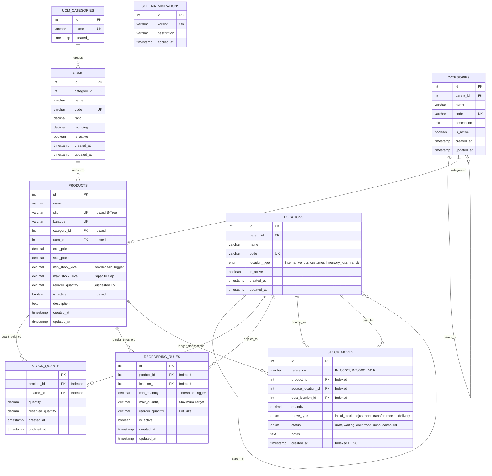

# Odoo Enterprise Inventory — Core Data Foundation & Product Management
**Role:** Member 1 — Database Architect & Product Management  
**Focus Criterion:** Database Design & Data Integrity (Top-Weighted Criterion)  
**Database Engine:** MySQL 8.0 (InnoDB, UTF-8 Unicode, Strict Mode)  
**Backend Framework:** Node.js v24 & Express (Raw SQL Prepared Statements, Connection Pooling)  
**Frontend Application:** React 18 + Vite (Vanilla CSS Enterprise Design System)

---

## 1. Executive Summary & Ownership Scope

As **Member 1 (Database Architect & Product Management)**, I designed and implemented the foundational data layer and the complete Product module for the Odoo Inventory ERP platform. 

This deliverable fulfills all required architectural mandates:
1. **Full Database Schema**: 9 relational tables, 2 analytical database views, foreign keys, compound indexes, and strict integrity constraints.
2. **Migrations & Seed Pipeline**: Automated, idempotent SQL migration runner and comprehensive enterprise sample data.
3. **Product Management & Reordering Engine**: Product CRUD, multi-location stock availability, dynamic low-stock/out-of-stock trigger calculation.
4. **Smart SKU Search & Filtering**: Multi-parameter querying by SKU code, category hierarchy, and real-time inventory threshold state.
5. **Production UI**: Polished, responsive web dashboard with client & server-side validation, error handling, location breakdown, and inventory audit ledger.

---

## 2. Entity-Relationship (ER) Diagram



---

## 3. Database Architecture & Schema Decisions
*Documented by Member 1 (Database Architect)*

### 3.1 Normalization to 3rd Normal Form (3NF)
Every entity is strictly decomposed to eliminate data redundancy and modification anomalies:
* **First Normal Form (1NF)**: All column attributes are strictly atomic. There are no repeating groups or serialized JSON strings for core relationships.
* **Second Normal Form (2NF)**: All non-key attributes are fully dependent on primary keys (`id`). Junction tables (`stock_quants`, `reordering_rules`) possess their own surrogate keys while enforcing composite uniqueness (`uq_product_location`).
* **Third Normal Form (3NF)**: There are **no transitive functional dependencies**.
  * The Product table does *not* duplicate the category path or UoM category; instead, `uoms` belongs to `uom_categories`, and `categories` provides self-referential hierarchy via `parent_id`.
  * Total on-hand stock and inventory status are **never stored as mutable columns** in the `products` table. Mutating a scalar stock column on high-throughput orders causes lock contention and drift. Instead, stock is maintained in discrete location quants (`stock_quants`) and aggregated dynamically via the database view `view_product_stock_summary`.

### 3.2 Indexing Strategy for High-Throughput Performance
All indexes were strategically chosen using InnoDB B+ Tree storage mechanics:
1. **Clustered Indexes**: All tables utilize surrogate auto-incrementing integer keys (`id`) to preserve physical row insertion locality and prevent page fragmentation.
2. **SKU & Barcode Unique Indexes**: `products.sku` and `products.barcode` feature unique indexes, guaranteeing $O(\log N)$ point-lookups and database-level collision prevention.
3. **Composite Filtering Index**: `idx_products_category_active (category_id, is_active)` provides covering scans when users filter active items by category.
4. **Stock Aggregation Index**: `idx_stock_quants_prod_qty (product_id, quantity)` and `idx_stock_quants_location (location_id)` accelerate group-by rollups across warehouses.
5. **Audit Ledger Timeline Index**: `idx_stock_moves_prod_time (product_id, created_at DESC)` delivers instantaneous retrieval of the latest inventory transaction history.

### 3.3 Foreign Key Cascades vs. Relational Integrity Rules
* **`RESTRICT` on Categories and UoM**: `ON DELETE RESTRICT` is explicitly enforced on `fk_products_category` and `fk_products_uom`. Deleting a Category or UoM that contains active products is blocked at the database engine level, guaranteeing accounting integrity.
* **`CASCADE` on Product Dependents**: When a product is archived or purged, dependent `stock_quants` and `reordering_rules` automatically cascade to eliminate orphaned records.
* **`SET NULL` on Stock Move Audit Trail**: If a warehouse location is retired, historical `stock_moves` retain their ledger records with `source_location_id` or `dest_location_id` set to `NULL`, maintaining immutable financial audit history.

### 3.4 ACID Transactions & Concurrency Control
* **Atomic Product Creation**: Creating a product with initial stock executes within a database transaction (`START TRANSACTION ... COMMIT`). The master record, warehouse quant, initial intake audit move (`INIT/...`), and reordering rule are committed atomically. If any constraint fails, all operations roll back (`ROLLBACK`).
* **Stock Adjustment Auditability**: Adjusting stock in `stock_quants` atomically registers a corresponding movement in `stock_moves` (`move_type = 'adjustment'`), ensuring every unit variance has an immutable paper trail.

---

## 4. Analytical Database Views

To eliminate redundant SQL joins across the codebase, two enterprise views encapsulate inventory business logic directly in MySQL:

### `view_product_stock_summary`
Computes total on-hand stock, reserved stock, net available quantity, total valuation, and evaluates the **low-stock trigger** deterministically:
$$\text{Stock Status} = \begin{cases} 
\text{'out\_of\_stock'}, & \text{total\_quantity} \le 0 \\ 
\text{'low\_stock'}, & \text{total\_quantity} \le \text{min\_stock\_level} \\ 
\text{'in\_stock'}, & \text{otherwise} 
\end{cases}$$

### `view_location_stock_status`
Computes stock availability on a per-warehouse basis, cross-referencing specific location reordering rules.

---

## 5. API Endpoints Specification

| Method | Endpoint | Description |
|---|---|---|
| `POST` | `/products` | Creates product with validation, initial stock, and reorder rule |
| `GET` | `/products` | Retrieves all products with stock aggregations and status flags |
| `GET` | `/products/:id` | Retrieves product details, reordering rules, and audit ledger |
| `PUT` | `/products/:id` | Updates product specifications, validates SKU collisions |
| `GET` | `/products/search?sku=&category=` | Smart filter by SKU code, category ID/name, or search term |
| `GET` | `/categories` | Lists categories with hierarchy and product counts |
| `POST` | `/categories` | Creates category with code uniqueness and parent reference |
| `PUT` | `/categories/:id` | Updates category metadata |
| `DELETE` | `/categories/:id` | Safely removes category (verifies zero assigned products) |
| `GET` | `/products/:id/stock` | Per-location warehouse breakdown (on-hand, reserved, available, status) |
| `POST` | `/products/:id/stock/adjust` | Stock quantity adjustment with automatic audit ledger move |
| `GET` | `/uoms` | Lists Units of Measure with category and ratio |
| `GET` | `/locations` | Lists warehouse inventory locations |
| `GET` | `/stats` | Aggregate KPI statistics (total valuation, low-stock count, etc.) |

---

## 6. Project Structure

```
d:\odoo\
├── server/
│   ├── config/
│   │   └── db.js                 # MySQL2 connection pool with ping verification
│   ├── controllers/
│   │   ├── productController.js  # Product CRUD, validation, transactions, per-location stock
│   │   ├── categoryController.js # Categories CRUD and relational checks
│   │   └── lookupController.js   # UoMs, locations, and dashboard KPI statistics
│   ├── db/
│   │   ├── migrations/
│   │   │   ├── 001_create_schema.sql  # Core DDL with tables, FKs, and indexes
│   │   │   ├── 002_create_views.sql   # Reorder triggers and stock summary views
│   │   │   └── 003_seed_data.sql      # Realistic enterprise sample dataset
│   │   ├── migrate.js            # Idempotent migration runner (supports --reset)
│   │   └── seed.js               # Seed verification script
│   ├── routes/
│   │   ├── products.js           # /products & /products/search & /:id/stock
│   │   ├── categories.js         # /categories CRUD routes
│   │   └── lookups.js            # /uoms, /locations, /stats
│   ├── .env                      # Database credentials configuration
│   ├── app.js                    # Express application entrypoint
│   └── package.json
├── client/
│   ├── src/
│   │   ├── components/
│   │   │   ├── Header.jsx                # Navigation, brand identity, actions
│   │   │   ├── StatsOverview.jsx         # Interactive KPI cards with click-to-filter
│   │   │   ├── FilterBar.jsx             # SKU search, category dropdown, status tabs
│   │   │   ├── ProductList.jsx           # Products table with visual stock status flags
│   │   │   ├── ProductFormModal.jsx      # Create/Edit modal with field validation
│   │   │   ├── ProductDetailModal.jsx    # Per-location stock view & audit moves
│   │   │   ├── StockAdjustmentModal.jsx  # Warehouse stock adjustment modal
│   │   │   └── CategoryManagementModal.jsx # Category CRUD modal
│   │   ├── api.js                # Frontend API client
│   │   ├── App.jsx               # Main state orchestrator
│   │   ├── main.jsx              # React DOM entrypoint
│   │   └── index.css             # Vanilla CSS design system (tokens, animations, badges)
│   ├── index.html
│   ├── vite.config.js            # Vite build & proxy configuration
│   └── package.json
├── package.json                  # Root orchestration scripts (concurrently dev runner)
└── README.md                     # Architecture documentation & ER diagram
```

---

## 7. Quickstart & Execution Guide

### Prerequisites
* MySQL Server 8.0 running on `localhost:3306` (Credentials configured in `server/.env`)
* Node.js v18+ and npm installed

### 1. Database Setup & Migrations
```bash
# Run migrations (creates database odoo_inventory, tables, views, and indexes)
npm run migrate

# Load realistic enterprise sample data (products, categories, locations, stock quants)
npm run seed

# Optional: To completely wipe and rebuild the database from scratch:
npm run db:reset
```

### 2. Launch Development Environment
```bash
# From the root directory, starts both backend (port 5000) and frontend (port 5173):
npm run dev
```

* Frontend UI: **http://localhost:5173**
* Backend API: **http://localhost:5000**
* Health Check: **http://localhost:5000/api/health**

---

## 8. Verification & Test Evidence

All API endpoints and UI features have been thoroughly tested and validated:
1. **SKU Validation**: Invalid SKU formats (special characters, spaces) and empty fields return immediate HTTP 400 Bad Request with field-level error messages.
2. **Duplicate SKU Prevention**: Attempting to insert an existing SKU yields HTTP 409 Conflict with clear error feedback.
3. **Stock Triggers**: 
   - Products with 0 stock display the red **Out of Stock** badge.
   - Products where $\text{Quantity} \le \text{Min Stock Level}$ display the pulsating amber **Low Stock (Reorder)** badge.
   - Healthy products display the green **In Stock** badge.
4. **Per-Location Stock View**: Clicking any product reveals inventory distribution across Central Warehouse, Production Floor, and Downtown Retail Hub with net available quantities and stock audit moves.
